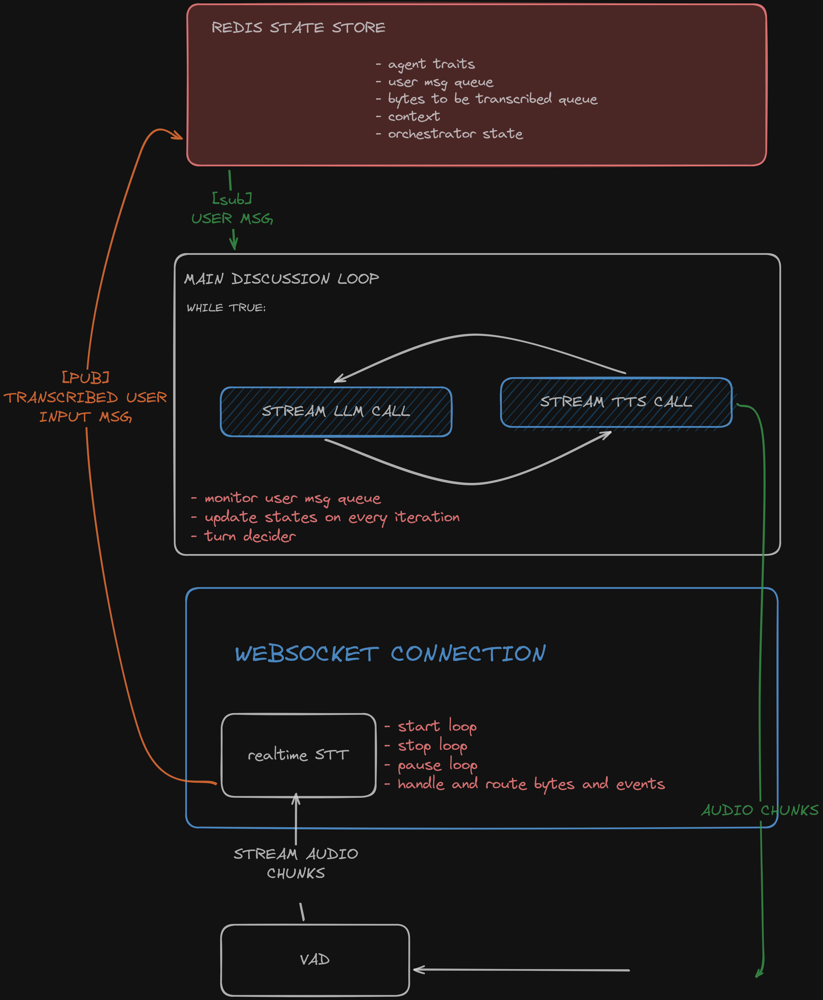

<h1 align="center">AI Council</h1>
<p align="center">
    
    
    
    
</p>


## Overview

AI Council allows you to create virtual discussion panels with multiple AI agents, each with unique roles, traits, and voices. The agents autonomously engage in conversations while you can join the discussion and influence the direction of the dialogue.

### Goal and use cases

-   **Simulated Panels**: Create expert panels for brainstorming, decision-making, or entertainment.
-   **Interactive Storytelling**: Engage with characters in a narrative-driven discussion.
-   **Educational Discussions**: Host debates or discussions on various topics for learning purposes.
-   **Interview Simulations**: Practice interviews with multiple AI interviewers.

### Proposed architecture



## Features

### Implemented

-   **Server**: FastAPI-based WebSocket server with Redis state management
-   **Multi-Agent System**: Create custom agents with distinct personalities, roles, and voices
-   **Discussion Loop**: Orchestrated conversation flow between agents
-   **Audio Streaming**: Real-time audio synthesis and streaming using ElevenLabs
-   **Session Management**: Create and manage multiple discussion sessions (needs auth)
-   **Text Input**: Backend support for user text input during discussions (queue-based)
-   **State Persistence**: Redis-backed session state storage

### Todo

-   **Real-time Audio Transcription**: Transcribe incoming user audio bytes in real-time on CPU with VAD
-   **Authentication**: Secure session creation and management
-   **Robust Frontend**: Develop a user-friendly interface for session management and interaction with a zoom call like UI to immerse users in the multi-agent discussion

-   **Conversation History**: Better context management
-   **Discussion Controls**: Pause, resume, and modify agents mid-discussion

## Architecture

### Backend

-   **Framework**: FastAPI with WebSocket support
-   **State Management**: Redis for session and conversation state
-   **AI Integration**: LLM-based agent orchestration using langchain
-   **Audio Synthesis**: ElevenLabs API for voice generation
-   **Audio Processing**: Whisper streaming or other for transcription (in development)

### Frontend

Basic vibecoded html file for testing websocket connection and streaming. Future plans for a more robust UI.

## Getting Started

### Prerequisites

-   Python 3.11+
-   Redis server (docker recommended)
-   ElevenLabs API key (for voice synthesis)
-   OpenAI API key (support for more models soon)

### Installation

1. Clone the repository:

```bash
git clone <repository-url>
cd ai-council
```

2. Create and activate virtual environment:

```bash
python -m venv .venv
.venv\Scripts\activate  # Windows
# or
source .venv/bin/activate  # Linux/Mac
```

3. Install dependencies:

```bash
pip install -r requirements.txt
```

4. Set up environment variables:

```bash
# Create .env file with:
OPENAI_API_KEY=your_openai_key
ELEVENLABS_API_KEY=your_elevenlabs_key
REDIS_HOST=localhost
REDIS_PORT=6379
```

5. Start Redis server:

```bash
docker pull redis
docker run -d -p 6379:6379 redis
```

6. Run the application:

```bash
python main.py
# Open frontend/index.html in your browser
```

## Contributing

This is an early-stage project. Key areas for contribution:

1. Real-time audio transcription optimization
2. Frontend UI/UX improvements
3. Agent personality enhancements
4. Prompt optimization
5. Conversation flow optimization

## License

This project is licensed under the [GNU General Public License v3.0](https://github.com/legit-programmer/ai-council/blob/main/LICENSE)
